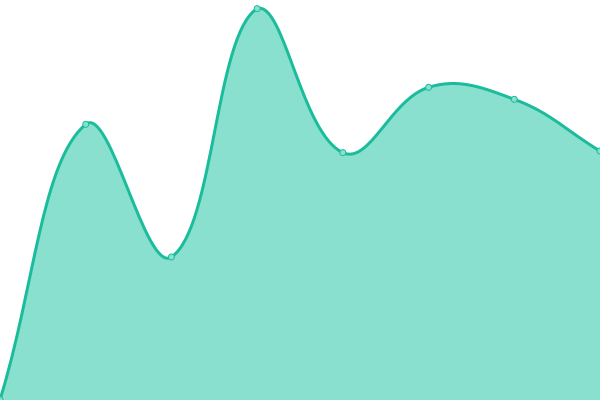

# [📈 z LABS Live Status](https://carloszaffonatto.github.io/upptime): <!--live status--> **🟧 Partial outage**

This repository contains the open-source uptime monitor and status page for [Carlos Zaffonatto](https://www.linkedin.com/in/carloszaffonatto/), powered by [Upptime](https://github.com/upptime/upptime).

With [Upptime](https://upptime.js.org), you can get your own unlimited and free uptime monitor and status page, powered entirely by a GitHub repository. We use [Issues](https://github.com/carloszaffonatto/upptime/issues) as incident reports, [Actions](https://github.com/carloszaffonatto/upptime/actions) as uptime monitors, and [Pages](https://carloszaffonatto.github.io/upptime) for the status page.

<!--start: status pages-->
<!-- This summary is generated by Upptime (https://github.com/upptime/upptime) -->
<!-- Do not edit this manually, your changes will be overwritten -->
<!-- prettier-ignore -->
| URL | Status | History | Response Time | Uptime |
| --- | ------ | ------- | ------------- | ------ |
|  [Zaffonatto.it](https://www.zaffonatto.it) | 🟩 Up | [zaffonatto-it.yml](https://github.com/carloszaffonatto/upptime/commits/HEAD/history/zaffonatto-it.yml) | 

 572ms
     
 | 

<a href="https://carloszaffonatto.github.io/upptime/history/zaffonatto-it">100.00%</a>
    

|  [z LABS](https://d.zaffonatto.it) | 🟩 Up | [z-labs.yml](https://github.com/carloszaffonatto/upptime/commits/HEAD/history/z-labs.yml) | 

 512ms
     
 | 

<a href="https://carloszaffonatto.github.io/upptime/history/z-labs">100.00%</a>
    

|  [Plex](https://u-x.zaffonatto.it/web/index.html#!/) | 🟩 Up | [plex.yml](https://github.com/carloszaffonatto/upptime/commits/HEAD/history/plex.yml) | 

 524ms
     
 | 

<a href="https://carloszaffonatto.github.io/upptime/history/plex">100.00%</a>
    

|  [OCI VPN](https://vpn-2.zaffonatto.it/) | 🟥 Down | [oci-vpn.yml](https://github.com/carloszaffonatto/upptime/commits/HEAD/history/oci-vpn.yml) | 

 611ms
     
 | 

<a href="https://carloszaffonatto.github.io/upptime/history/oci-vpn">95.12%</a>
    

<!--end: status pages-->

[**Visit our status website →**](https://carloszaffonatto.github.io/upptime)

## 📄 License

- Powered by: [Upptime](https://github.com/upptime/upptime)
- Code: [MIT](./LICENSE) © [Anand Chowdhary](https://anandchowdhary.com), supported by [Pabio](https://pabio.com)
- Data in the `./history` directory: [Open Database License](https://opendatacommons.org/licenses/odbl/1-0/)
